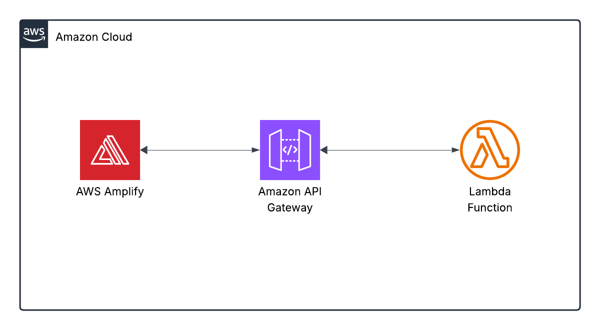

# Calculator
A simple project to deploy HTML Calculator with AWS Lambda via API Gateway, and also deployed using [Terraform](#terraform).
#
I have used ChatGPT to generate codes for HTML and AWS Lambda function (Python), then hosted the HTML page using AWS Amplify. 

## Cost
All services used are eligible for the [AWS Free Tier](https://aws.amazon.com/free/). After completing the project, it is better to delete all resources used.

## The Application Codes
The application codes are here in this repository.

This is the diagram.



Create an HTML interface for a calculator that uses AWS Lambda, you need:

1. An HTML + JavaScript frontend that sends input (expression or values) to an API Gateway endpoint.

2. An AWS Lambda function (connected to API Gateway) that receives the input, processes the calculation, and returns the result.

3. Replace the placeholder URL https://your-api-id.execute-api.region.amazonaws.com/prod/calculate with your actual API Gateway endpoint.


4. ✅ Steps to Deploy Lambda with API Gateway

       A. Go to AWS Lambda, create a new function, paste the Python code.

       B. Add API Gateway trigger, use HTTP API or REST API.
  
1: For HTTP API
  
   a/ Open the AWS Console → API Gateway → Create API → HTTP API.

   b/ Integration

      Choose “Add integration” → Lambda function.

      Select the region and start typing your Lambda’s name, then pick it.

   c/ Routes

       Under “Routes”, click “Add route”.

   d/ Method: POST, Path: /calc.

       Attach your Lambda integration to this route.
	

   e/ Stages
    
       create stage.
	   
	  
   f/ CORS

       In the left nav, choose “CORS”.

       Enable CORS, allowing at least your site’s origin (or * for testing).
       Select * for all and method POST, and Max Age 300  and no for credential.
	  

   g/ Deploy

       Click “Deploy” → note the Invoke URL (e.g. https://abcd1234.execute-api.us-east-1.amazonaws.com).

       Your full endpoint is then:

       https://<api-id>.execute-api.<region>.amazonaws.com/calculate
       
********************

  2/ Configure a REST API:
  
   a/ Create the REST API

       Go to API Gateway → REST APIs → Build under “REST API (Not private)”.

       Give it a name (e.g. “CalculatorAPI”) and click Create API.

   b/ Define a Resource & Method

       In the left nav, under your new API, click Resources.

       Click Actions → Create Resource.

       Resource Name: calculate

       Resource Path: /calculate

       Click Create Resource.

   c/ Select the /calculate resource, then Actions → Create Method → choose POST and click the checkmark.

   d/ Integrate with Lambda

        For the POST method’s Integration type, select Lambda Function.

        Check Use Lambda Proxy integration.

        Region: your Lambda’s region, then enter your Lambda’s name.

        Click Save, then OK to grant permission.

   e/ Enable CORS

        With /calculate still selected, click Actions → Enable CORS.

        In the popup, leave defaults (* for origins) and click Enable and replace existing CORS headers.

   f/ Deploy the API

        Click Actions → Deploy API.

        Deployment stage: [New Stage], name it e.g. prod.

        Click Deploy.

        Note the Invoke URL at the top of the stage view.

        https://{rest-api-id}.execute-api.{region}.amazonaws.com/prod
		
        Your full endpoint becomes: *****important****

        https://{rest-api-id}.execute-api.{region}.amazonaws.com/prod/calculate
	
*********************
   Deploy Web site using AWS Amplify:

     1/ first remember to replace the placeholder URL https://your-api-id.execute-api.region.amazonaws.com/prod/calculate with your actual API Gateway endpoint.
 
     2/ Deploy an app --> Deploy without Github --> Drag and Drop your index.html (Zipped) --> Save and Deploy.

```html

<!DOCTYPE html>
<html lang="en">
<head>
  <meta charset="UTF-8">
  <title>Lambda Calculator</title>
  <style>
    body {
      font-family: Arial, sans-serif;
      background: #f4f4f4;
      display: flex;
      justify-content: center;
      align-items: center;
      height: 100vh;
    }

    .calculator {
      background: #fff;
      padding: 20px;
      border-radius: 15px;
      box-shadow: 0 0 10px rgba(0,0,0,0.2);
      width: 300px;
    }

    .display {
      width: 100%;
      height: 50px;
      text-align: right;
      font-size: 24px;
      margin-bottom: 10px;
      padding: 10px;
      border: 1px solid #ccc;
      border-radius: 8px;
      box-sizing: border-box;
    }

    .buttons {
      display: grid;
      grid-template-columns: repeat(4, 1fr);
      gap: 10px;
    }

    button {
      padding: 20px;
      font-size: 18px;
      border: none;
      border-radius: 8px;
      background: #e0e0e0;
      cursor: pointer;
    }

    button:hover {
      background: #ccc;
    }

    .equal {
      background: #4caf50;
      color: white;
    }

    .clear {
      background: #f44336;
      color: white;
    }
  </style>
</head>
<body>

<div class="calculator">
  <input type="text" class="display" id="display" readonly>
  <div class="buttons">
    <button onclick="clearDisplay()" class="clear">C</button>
    <button onclick="appendToDisplay('(')">(</button>
    <button onclick="appendToDisplay(')')">)</button>
    <button onclick="appendToDisplay('/')">÷</button>

    <button onclick="appendToDisplay('7')">7</button>
    <button onclick="appendToDisplay('8')">8</button>
    <button onclick="appendToDisplay('9')">9</button>
    <button onclick="appendToDisplay('*')">×</button>

    <button onclick="appendToDisplay('4')">4</button>
    <button onclick="appendToDisplay('5')">5</button>
    <button onclick="appendToDisplay('6')">6</button>
    <button onclick="appendToDisplay('-')">−</button>

    <button onclick="appendToDisplay('1')">1</button>
    <button onclick="appendToDisplay('2')">2</button>
    <button onclick="appendToDisplay('3')">3</button>
    <button onclick="appendToDisplay('+')">+</button>

    <button onclick="appendToDisplay('0')">0</button>
    <button onclick="appendToDisplay('.')">.</button>
    <button onclick="calculate()" class="equal">=</button>
  </div>
</div>

<script>
  const API_URL = "https://<api-id>.execute-api.<region>.amazonaws.com/(API_Route_Name) OR (STAGE_name/API_Resource_Name)";//for HTTP API use(API_Route_Name) , for REST API use (STAGE_name/API_Resource_Name). 

  function appendToDisplay(value) {
    document.getElementById('display').value += value;
  }

  function clearDisplay() {
    document.getElementById('display').value = '';
  }

  async function calculate() {
    const expression = document.getElementById('display').value;

    const response = await fetch(API_URL, {
      method: "POST",
      headers: {
        "Content-Type": "application/json"
      },
      body: JSON.stringify({ expression })
    });

    const result = await response.json();

    if (response.ok) {
      document.getElementById('display').value = result.result;
    } else {
      document.getElementById('display').value = "Error";
    }
  }
</script>

</body>
</html>

```

  **********************************   
    ..... Done ......
    
## Terraform


✅ What This Setup Will Do

1. Create an AWS Lambda function (Python 3.13) to evaluate math expressions. 

2. Create an API Gateway endpoint (/calculate) to invoke the Lambda.

3. Enable CORS for web access from your HTML frontend.


🗂️ File Structure

```
calculator-lambda/
├── main.tf
├── variables.tf
├── lambda/
│   └── lambda_function.py

```

🧠 1. lambda/lambda_function.py

```python

import json
def lambda_handler(event, context):
    try:
        body = json.loads(event['body'])
        expression = body.get("expression", "")

	result = eval(expression, {"__builtins__": {}}, {})

        return {
            "statusCode": 200,
            "headers": {
                "Content-Type": "application/json",
                "Access-Control-Allow-Origin": "*"
            },
            "body": json.dumps({ "result": result })
        }

    except Exception as e:
        return {
            "statusCode": 400,
            "body": json.dumps({ "error": str(e) })
        }
```		


⚙️ 2. main.tf

```
provider "aws" {
  region = "us-east-1" # Change to your region
}

resource "aws_iam_role" "lambda_exec_role" {
  name = "lambda-exec-role"

  assume_role_policy = jsonencode({
    Version = "2012-10-17"
    Statement = [{
      Effect = "Allow"
      Principal = {
        Service = "lambda.amazonaws.com"
      }
      Action = "sts:AssumeRole"
    }]
  })
}

resource "aws_iam_role_policy_attachment" "lambda_logs" {
  role       = aws_iam_role.lambda_exec_role.name
  policy_arn = "arn:aws:iam::aws:policy/service-role/AWSLambdaBasicExecutionRole"
}

data "archive_file" "lambda_zip" {
  type        = "zip"
  source_dir  = "${path.module}/lambda"
  output_path = "${path.module}/lambda.zip"
}

resource "aws_lambda_function" "calculator" {
  function_name = "calculator-function"
  role          = aws_iam_role.lambda_exec_role.arn
  runtime       = "python3.12"
  handler       = "lambda_function.lambda_handler"
  filename      = data.archive_file.lambda_zip.output_path
  source_code_hash = data.archive_file.lambda_zip.output_base64sha256
}

resource "aws_apigatewayv2_api" "api" {
  name          = "calculator-api"
  protocol_type = "HTTP"
  cors_configuration {
    allow_methods = ["POST"]
    allow_origins = ["*"]
    allow_headers = ["*"]
  }
}

resource "aws_lambda_permission" "api_gateway" {
  statement_id  = "AllowInvokeByAPIGateway"
  action        = "lambda:InvokeFunction"
  function_name = aws_lambda_function.calculator.function_name
  principal     = "apigateway.amazonaws.com"
  source_arn    = "${aws_apigatewayv2_api.api.execution_arn}/*/*"
}

resource "aws_apigatewayv2_integration" "integration" {
  api_id             = aws_apigatewayv2_api.api.id
  integration_type   = "AWS_PROXY"
  integration_uri    = aws_lambda_function.calculator.invoke_arn
  integration_method = "POST"
  payload_format_version = "2.0"
}

resource "aws_apigatewayv2_route" "route" {
  api_id    = aws_apigatewayv2_api.api.id
  route_key = "POST /calculate"
  target    = "integrations/${aws_apigatewayv2_integration.integration.id}"
}

resource "aws_apigatewayv2_stage" "stage" {
  api_id      = aws_apigatewayv2_api.api.id
  name        = "$default"
  auto_deploy = true
}

output "api_endpoint" {
  value = aws_apigatewayv2_api.api.api_endpoint
}

```
************

📦 3. variables.tf (optional)

# Empty for now, or define AWS region if you want to pass it via CLI

************
🧪 How to Deploy

1. Install Terraform and configure AWS CLI (aws configure).

2. Inside your project folder:

   terraform init
   
   terraform apply -auto-approve

4. After deployment, Terraform will output the API endpoint:

   api_endpoint = "https://xyz123.execute-api.us-east-1.amazonaws.com"

5. Use it in your HTML file:

   const API_URL = "https://xyz123.execute-api.us-east-1.amazonaws.com/calculate";
